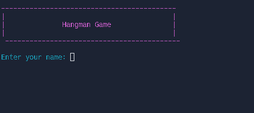

# Hangman Game

A simple hangman game written in Python.Its a Python application that allows users to play the classic word guessing game. It offers an interactive and immersive experience where players can test their vocabulary skills by guessing letters and revealing hidden words.

## Instructions

To run the Hangman game.

Make sure Python 3 is installed on your computer.
Clone this repository or download the source code files.

### follow these steps:

1. Run the game by executing the `hangman.py` file.
2. Enter your name and start guessing the letters of the word.
3. You have 6 attempts to guess the word correctly.
4. If you guess a letter that is in the word, it will be revealed.
5. If you guess a letter that is not in the word, you will lose an attempt.
6. If you run out of attempts, the game is over.
7. If you guess the word correctly, you win!

## Features

* Randomly selects a word from a list of words.
* Displays the word with dashes for each letter.
* Shows the number of remaining attempts.
* Displays the hangman as the user loses attempts.
* Allows the user to play again.

## User Experience

The Hangman game provides an interactive and immersive experience for players. It allows users to engage in a challenging word guessing game and test their vocabulary skills. The game offers the following user experience:

* Player Customization: Users can personalize their experience by entering their name before starting the game.
    
 

* Random Word Selection: For each game session, a random word is chosen from the list provided to ensure a unique and unpredictable gaming experience.

* Visual Feedback: The game shows a hangman image that gradually changes when a wrong guess is made, enhancing the gaming experience.

 

* Presumed Mechanism: Players can enter individual letters as guesses, and the game checks the validity of their input, provides feedback on its correctness, and updates the word display accordingly.
* Win/Loss Conditions: The game determines whether the player succeeds in guessing the whole word or exhausts attempts and sends the appropriate message announcing the result.

 

 

* Same input as previous Check: if the user enters the same letter which was previously sucessfull the game displays
the message that this letter was previously entered.

* Restart Options: After finishing the game, the user can restart the game and play again without closing and reopening the application.

 

## Existing Features

* Random word selection from a word list.
* Display of the word with dashes for each letter.
* Tracking and display of remaining attempts.
* Display of the hangman image based on incorrect guesses.
* Input validation and feedback messages.
* Option to play again.

## Future Features

The Hangman game has potential for further enhancements and additional features. Some of the possible future features include:

* GUI Enhancement: Adding a graphical user interface (GUI) to enhance the gaming experience and provide visual elements for the game.
* Sound Effects: Incorporating sound effects to provide auditory feedback, such as a sound when a wrong guess is made.
* Leaderboard: Implementing a leaderboard to track and display the user's scores and achievements.
* Difficulty Levels: Allowing the user to choose the difficulty level of the game, such as easy, medium, or hard, with varying word lengths or limited attempts.

## Technical Design

The Hangman game is implemented using the following components:

* Python programming language.
* colorama package for colored terminal output.

The game logic involves random word selection, input validation, word display, hangman image display, and win/loss conditions.

## Technologies Used
### Frameworks & Tools

* Python 3
* colorama 0.4.4

## Validation

The Hangman game has been tested and validated to ensure its functionality and correctness. The following testing methods were employed:

* Unit Testing: Each function and game component was tested individually to ensure it behaves as expected and returns the correct results.
* Manual Testing: The game was played multiple times with various input scenarios to validate its overall functionality and user experience.
* Boundary Testing: The game was tested with extreme input cases, such as guessing all letters correctly in one attempt and exhausting all attempts without guessing any correct letters, to verify the game's behavior in such scenarios.

## Bugs

The following bugs were identified during testing:

### Solved Bugs
* Issue: None

### Remaining Bugs
* Issue: None

## Deployment

The Hangman game is deployed on HEROKU follow this link to play the game https://cipp3hangman-7a74cae7b2f1.herokuapp.com/.

## Credits

### Author

* Chris4891
